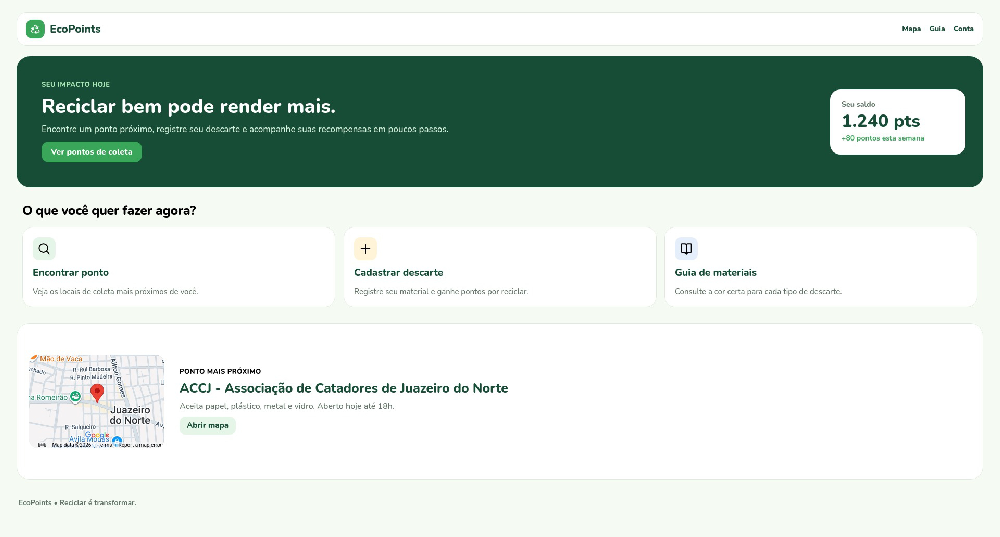
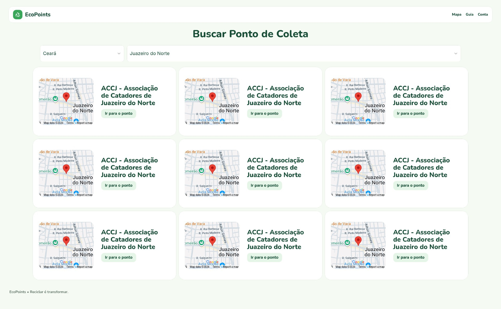
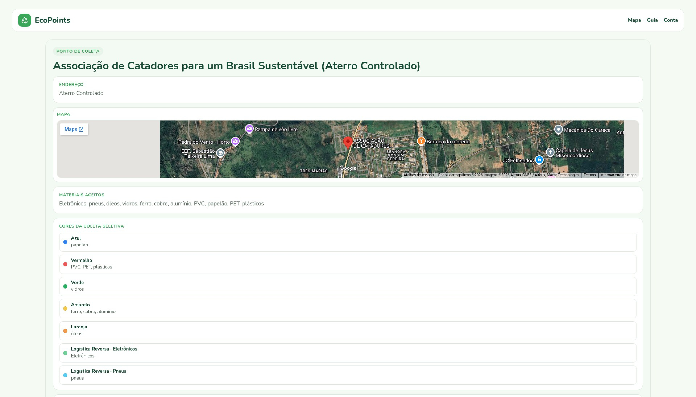

# Protótipo de alta fidelidade
O protótipo de alta fidelidade foi feito por meio do [Framer](https://framer.com/projects/EcoPoints--QIvRwmu8A4xHIS8jJkBs-jk5Re).

## Página Home

## Pontos de Coleta

## Ponto de Coleta
