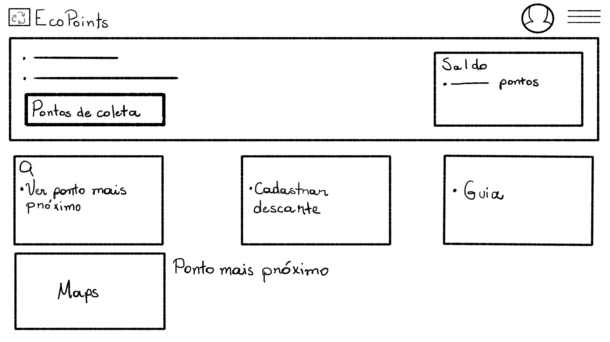
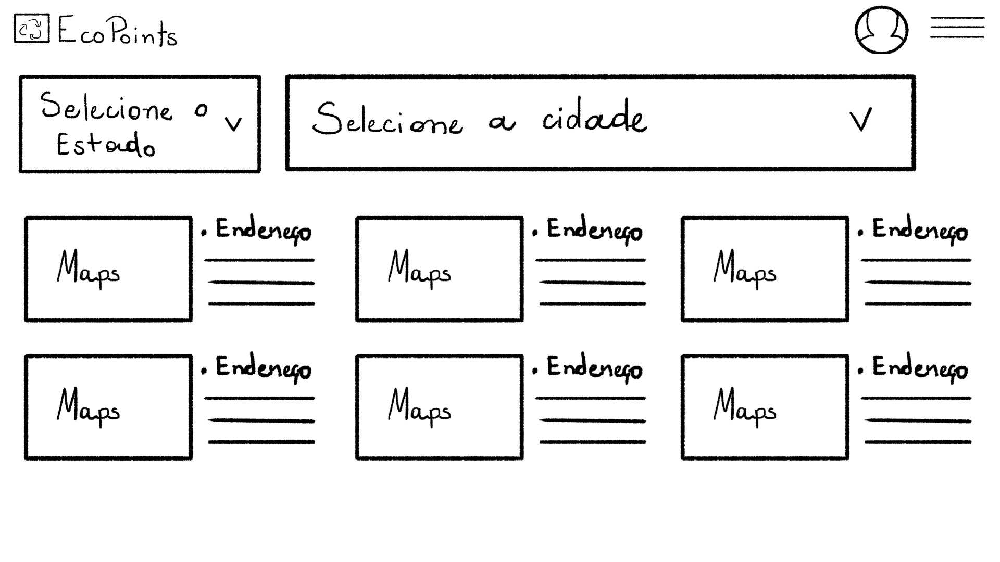

# Protótipo de baixa fidelidade
O protótipo de baixa fidelidade foi desenhado à mão, com auxílio de uma mesa digitalizadora, com o aplicativo de desenho [Krita](../../imgs/prototypes/low-fidelity-prototype/).

## Página Home

## Pontos de coleta
